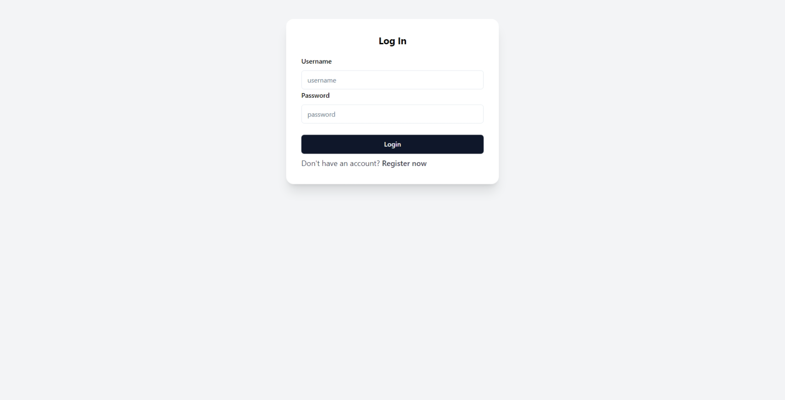
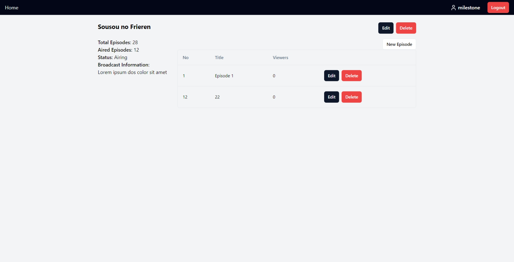

# ListWibuKu - Wibu Watch

React + TypeScript + Vite

## Build

`docker build . -t listwibuku-spa-service`

## Run the container

Creat `.env` file (example can be found in `.env.exampe`), then do

`docker run -d -p 8080:8080 listwibuku-spa-service`

This template provides a minimal setup to get React working in Vite with HMR and some ESLint rules.

Currently, two official plugins are available:

- [@vitejs/plugin-react](https://github.com/vitejs/vite-plugin-react/blob/main/packages/plugin-react/README.md)
  uses [Babel](https://babeljs.io/) for Fast Refresh
- [@vitejs/plugin-react-swc](https://github.com/vitejs/vite-plugin-react-swc) uses [SWC](https://swc.rs/) for Fast
  Refresh

## Expanding the ESLint configuration

If you are developing a production application, we recommend updating the configuration to enable type aware lint rules:

- Replace `plugin:@typescript-eslint/recommended` to `plugin:@typescript-eslint/recommended-type-checked`
  or `plugin:@typescript-eslint/strict-type-checked`
- Optionally add `plugin:@typescript-eslint/stylistic-type-checked`
- Install [eslint-plugin-react](https://github.com/jsx-eslint/eslint-plugin-react) and
  add `plugin:react/recommended` & `plugin:react/jsx-runtime` to the `extends` list

## End Result

### Summary

This app is used for ListWibuKu service administration. Operations include creating and modifying users, CRUD on anime, CRUD on episodes, and uploading stream files.

### Features and Screens

Login

Register

Change Password

Homepage

CRUD Anime

CRUD Anime Episode

### Contributions

Note: tasks below include client side and server side setups
| Task | NIM |
|--------------------------|----------|
| File upload | 13521093 |
| Authentication | 13521093 |
| Homepage and list filter | 13521074 |
| Episode CRUD | 13521074 |
| Anime CRUD | 13521093 |
